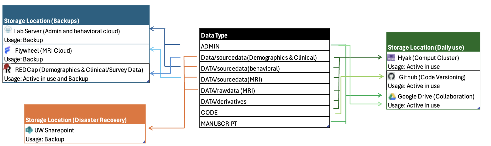

# The Storage Ecosystem

We utilize specific storage locations for specific tasks to ensure data safety and efficiency. We do not duplicate the entire directory tree everywhere.

Rule of Thumb:

* Storage Locations are for safe-keeping and "Sources of Truth."
* Active Locations are for computing, coding, and writing.

***

## Part 1: Storage & Archives (The "Backups")

_These locations are primarily for data preservation. Treat files here as the "Master Copies."_

### **1. The Lab Server (Central Hub)**

* Role: The aggregator for non-imaging data and the final landing spot for analysis results.
*   Contents:

    ```
    Project_Name/
    ├── ADMIN/
    ├── DATA/
    │   ├── sourcedata/       # Behavioral Logs Only
    │   └── rawdata/          # Behavioral TSVs Only
    └── MANUSCRIPT/           # Archive of final papers
    ```
* Note: We do not store raw MRI data here.
* Sync Routine:&#x20;
  * Behavioral data is uploaded here immediately (within 24 hours after gathered by experimenter).&#x20;
  * Final analysis results are pulled back here for safekeeping (timeline?).

### **2. Flywheel (MRI Master Database)**

* Role: The "Source of Truth" for all neuroimaging data. Handles acquisition, conversion, and initial QC.
*   Contents:

    ```
    Project_Name/
    └── DATA/
        ├── sourcedata/       # Raw DICOMs from scanner
        └── rawdata/          # BIDS-converted NIfTI files
    ```
* Key Feature: BIDS curation and "Gears" (containers) for initial QC/preprocessing.
* Sync Routine: MRI data is uploaded here immediately (within 24 hours after gathered by CNH).&#x20;

### **3. UW SharePoint (Disaster Recovery)**

* Role: Secure, HIPAA-compliant, immutable backup for ALL unrecoverable source data (MRI + Behavioral).
* Storage Policy: "Raw Assets Only" (No derivatives, no scratch files).
*   Contents:

    ```
    Project_Name/
    └── DATA/
        ├── sourcedata/       # The Safety Net (DICOMs & Behavioral Logs)
        └── rawdata/          # The Standard (BIDS NIfTIs & TSVs)
        └── derivatives/  #Final results synced back from Hyak
    ```
* Sync Routine: Once a month (eg. last work day of each month by ?)

***

## Part 2: Active Use (The "Workhorses")

_These locations are temporary workspaces. Data here is transient, changing, or being computed on._

### **1. Hyak (High-Performance Computing)**

* Role: Heavy computation and pipeline execution (fMRIPrep, FSL, PyTorch).
* Storage Policy:&#x20;
  * Scratch Space: Final Code & Derivatives Only (Persistent during project).
  * Scrub Space: Temporal Code and intermediate results (Deleted automatically if not modified for 30 days).
*   Contents

    ```
    Project_Name/
    ├── DATA/
    │   └── derivatives/      # Output of pipelines (preproc, stats)
    └── CODE/                 # Analysis scripts (Pulled from GitHub)
    ```
* Sync Routine: Once a month for fMRIPrep output (eg. last work day of each month by ?)

### **2. GitHub (Code Versioning)**

* Role: Version control, reproducibility, and script sharing.
* Storage Policy: "Code Only" (Strictly NO data).
*   Directory Subset:

    ```
    Project_Name/
    └── CODE/                 # .py, .sh, .ipynb files
    ```
* Workflow: develop code locally -> push to GitHub -> pull to Hyak for execution.

### **3. Google Drive (Collaboration)**

* Role: Collaborative writing, administrative tracking, and presentations.
* Storage Policy: "Documents Only" (Strictly NO Patient Data/PHI).
*   Directory Subset:

    ```
    Project_Name/
    ├── ADMIN/                # IRB protocols, Grant text, Schedules
    └── MANUSCRIPT/           # Drafts, Tables, Figures for papers
    ```

### **4.** UW REDCap **(**&#x44;emographics & Clinical/Survey Databas&#x65;**)** <mark style="color:red;">TBD</mark>

* Role: The "Source of Truth" for Participant PHI, Demographics, and Survey responses.
* Storage Policy: "System of Record" (Data originates here). strictly NO permanent storage of exported PHI on local laptops.
* Sync Routine (Export): Exported as `.csv` or `.tsv` to Lab Server (`DATA/sourcedata/behavioral/`) for analysis every-week?

<figure><figcaption></figcaption></figure>
